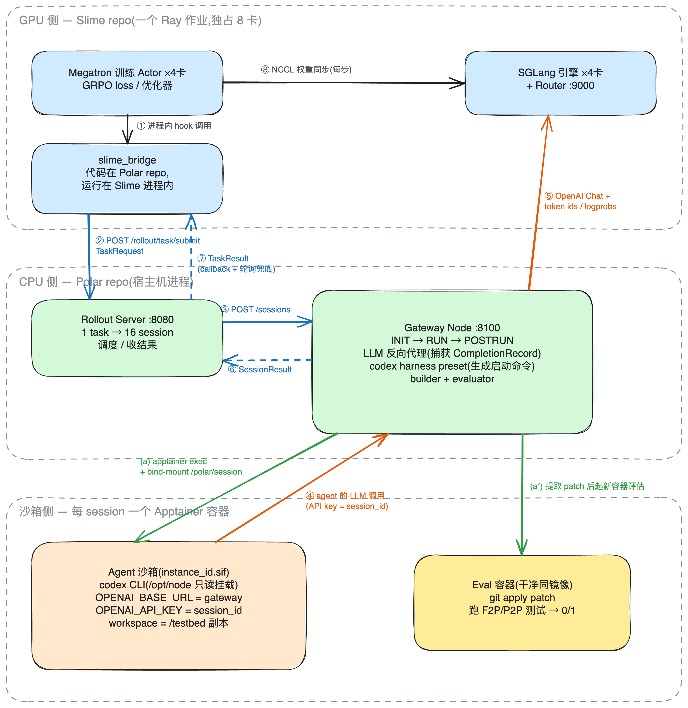
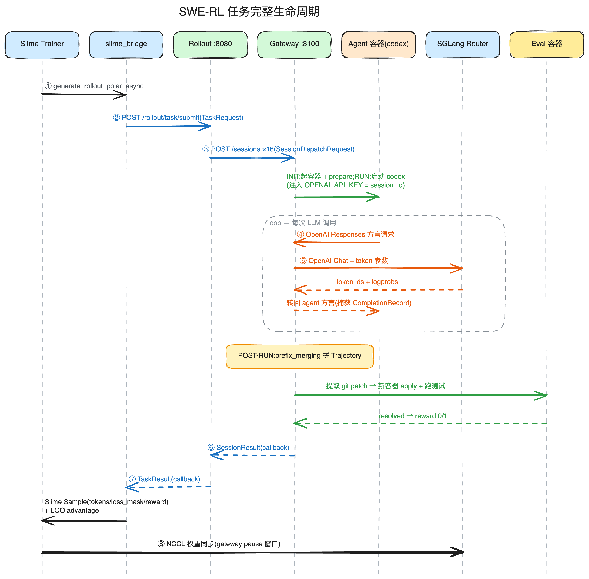

# Polar 架构分析:以 SWE-RL 任务为主线

> 基于 `examples/swegym_slime_grpo`(用 GRPO 在 293 个 SWE-Gym 任务上训练 Qwen3.5-4B)
> 梳理 Polar 框架的模块边界、数据流与模块内部的信息传递机制。
>
> 代码引用形如 `file:line`,均相对仓库根目录。

---

## 目录

1. [High-Level 架构图:边界与数据流](#1-high-level-架构图边界与数据流)
2. [一条 SWE-RL 任务的完整生命周期](#2-一条-swe-rl-任务的完整生命周期)
3. [模块拆分与职责](#3-模块拆分与职责)
4. [模块间传递什么(契约数据结构)](#4-模块间传递什么契约数据结构)
5. [模块内谁负责传递信息](#5-模块内谁负责传递信息)
6. [关键架构决策](#6-关键架构决策)

---

## 1. High-Level 架构图:边界与数据流

整个系统一共 **4 类执行体**:Slime 训练进程组(GPU)、Polar 服务(CPU)、
沙箱容器(agent)、eval 容器(打分)。

> 本图有一份可手工编辑的 Excalidraw 版本:
> [`polar_architecture_swe_rl.excalidraw`](assets/polar_architecture_swe_rl.excalidraw)
> (在 excalidraw.com 或 VS Code Excalidraw 插件中打开)。

### 1.1 四种边界(互不重合)

**Repo 边界(代码归属)**

- Slime repo:训练循环、Megatron、SGLang 引擎管理、权重同步。Polar 对它只做
  两个小 patch(保留 token ids/logprobs 透传,见 `scripts/patch/`)。
- Polar repo:rollout / gateway / agent / runtime / trajectory 全套,**外加
  `slime_bridge`** —— 桥接代码放在 Polar repo 里维护,但它是"客人":运行时被
  Slime 进程 import。
- codex:第三方 npm 包,两边 repo 都不含它的代码,以未改动的二进制形式被挂载
  进沙箱(`/opt/node`,只读)。

**进程边界(谁跑在哪)**

- `slime_bridge` **跑在 Slime 的训练进程里**(通过 `--rollout-function-path`
  注册为 hook),它和 Megatron 之间是①⑧那样的进程内函数调用/NCCL,和 Polar
  之间才是 HTTP(②⑦)。
- Rollout server 和 Gateway 是两个独立的宿主机进程,之间也是 HTTP(③⑥)——
  所以 gateway 可以水平铺到多台机器。
- codex 是沙箱容器内的独立进程。注意:**"codex harness" 这个 preset 类跑在
  gateway 进程里**,它只负责生成 shell 命令和写配置;真正的 codex CLI 进程在
  容器里。这是"harness ≠ agent"的关键区分。

**GPU/CPU 边界**

Slime 独占全部 GPU(4 训练 + 4 推理);Polar 全家 CPU-only。Polar 想要 token
就发 HTTP 给 SGLang router(⑤),想让推理暂停(权重同步窗口)就调 gateway 的
`/admin/inference/pause` 闸住出向请求。

**信任/隔离边界(沙箱)**

- Agent 容器:agent 可以任意折腾 workspace,唯一的对外出口是④——而④的目的地
  被环境变量偷换成了 gateway。**codex 完全不知道 Polar 存在**,它以为自己在调
  OpenAI,API key 其实是 session_id。
- Eval 容器:打分不在 agent 用过的容器里做,而是提取 git patch 后到一个
  **干净的新容器**里 apply + 跑测试(`refresh_runtime: true`)。这条边界的意义
  是防 reward hacking:agent 改测试文件、污染环境都无法影响评分环境。

### 1.2 数据流总表

| # | 从 → 到 | 载体/协议 | 内容 |
|---|---|---|---|
| ① | Slime trainer → slime_bridge | 进程内函数调用 | `(args, rollout_id, data_source)` → 期待返回 `list[list[Sample]]` |
| ② | slime_bridge → Rollout | HTTP JSON | `TaskRequest`:instruction、runtime 镜像、agent=codex、builder/evaluator 策略名、metadata(group_id/policy_version) |
| ③ | Rollout → Gateway | HTTP JSON | `SessionDispatchRequest`(task 拆成的单个 session + 回调地址) |
| ④ | codex → Gateway | HTTP(OpenAI Responses 方言) | agent 的每次 LLM 调用;session_id 藏在 API key 里 |
| ⑤ | Gateway → SGLang router | HTTP(OpenAI Chat 规范格式) | 改写后的请求;响应携带 prompt/response token ids + 逐 token logprobs,被捕获为 `CompletionRecord` |
| ⑥ | Gateway → Rollout | HTTP callback(+轮询兜底) | `SessionResult`:Trajectory(traces 含 token ids/loss_mask/logprobs/reward)+ timing |
| ⑦ | Rollout → slime_bridge | HTTP callback(+轮询兜底) | `TaskResult` = 16 个 SessionResult |
| ⑧ | Megatron → SGLang | NCCL(GPU-to-GPU) | 每步的新权重;同步期间经 gateway pause 闸住⑤ |
| (a) | Gateway ↔ 容器 | `apptainer exec` + bind-mount | 命令执行(启动 codex、提 patch)与文件进出(`/polar/session`) |

一个值得记住的判据:**凡是跨 repo/跨进程的地方都是 HTTP + Pydantic JSON**
(②③④⑤⑥⑦),**凡是性能敏感的地方都不走 HTTP**——权重同步走 NCCL(⑧),
文件进出走 bind-mount(a),completion 的权威副本留在 gateway 内存里(落盘
只是旁路)。

---

## 2. 一条 SWE-RL 任务的完整生命周期

> 本图也有 Excalidraw 版本:
> [`polar_lifecycle_swe_rl.excalidraw`](assets/polar_lifecycle_swe_rl.excalidraw)。

关键设计前提:**所有模块边界都是 HTTP**(rollout ↔ gateway ↔ trainer bridge),
所以训练框架、推理引擎、agent harness 三者都可替换;Polar 本体不依赖
torch/Megatron/Slime。

---

## 3. 模块拆分与职责

### 3.1 `slime_bridge` — 训练侧适配器(Polar 之外)

把 Slime 的 rollout/reward hook 接口翻译成 Polar 的 HTTP API。刻意放在 `polar`
包外:依赖方向单向(bridge 依赖 Polar,Polar 不依赖 Slime/Ray/torch)。职责:

- 用 `polar_task_template`(`polar_config.yaml`)把每个 SWE-Gym 样本组渲染成
  `TaskRequest`,填入 `{sample.metadata.instance_id}` 等占位符
  (`src/slime_bridge/config.py:130-155`);
- 异步提交、admission control(`batch_size × max_async_level` 窗口)、
  off-policy staleness 淘汰(`src/slime_bridge/rollout.py:448-464`);
- 把返回的 `Trajectory` 转成 Slime `Sample`,做 leave-one-trajectory-out
  advantage(`src/slime_bridge/reward_post_process.py:63-87`)。

四个注册的 hook 路径(`examples/swegym_slime_grpo/run.sh:231-235`):

| Slime 参数 | 实现 |
|---|---|
| `--rollout-function-path` | `slime_bridge.rollout.generate_rollout_polar_async` |
| `--custom-rm-path` | `slime_bridge.reward.reward_func`(透传 Polar 已嵌入的 reward) |
| `--custom-reward-post-process-path` | `slime_bridge.reward_post_process.post_process_rewards`(LOO advantage) |
| `--data-source-path` | `slime_bridge.data_source.CeilEpochRolloutDataSourceWithBuffer`(epoch 长度向上取整,不丢数据集尾巴) |

### 3.2 `polar.rollout` — 中央编排器(:8080)

刻意做薄的 FastAPI 服务:**只做编排、调度、收结果**,不跑 agent、不建轨迹、
不算 reward。

- `RolloutManager`(`src/polar/rollout/manager.py:93`):task 生命周期,
  1 个 task → `num_samples` 个 session,聚合结果、回调 trainer;
- `Pipeline`(`src/polar/rollout/pipeline.py:33`):每 session 派发到 gateway
  并等结果 —— callback Future + 轮询双通道(防丢回调、防"状态先翻转、payload
  未就绪"竞态,`pipeline.py:357-365`);
- `NodeScheduler`(`src/polar/rollout/balancer.py:55`):gateway 节点注册/心跳/
  健康,按 run → post-run → init 压力选最闲节点。

### 3.3 `polar.gateway` — 会话执行器 + LLM 透明代理(:8100,每 worker 一个)

整个框架最核心的模块,一身两职:

**(a) 会话执行**:`SessionDispatcher`(`src/polar/gateway/dispatcher.py:83`)
用三个隔离的 worker 池驱动 INIT(起容器+prepare)→ READY(等 run 槽位)→
RUNNING(跑 harness)→ POST-RUN(建轨迹+评估+回调)。

**(b) LLM 代理**:"harness as environment" 的实现关键 —— agent 不需要任何改造:

- 运行 agent 前注入环境变量:`OPENAI_BASE_URL` 指向 gateway,
  **`OPENAI_API_KEY = session_id`**(`src/polar/gateway/node.py:766-773`);
- catch-all 路由(`src/polar/gateway/server.py:609`)接住 agent 的每次 LLM 调用:
  `detection.py` 识别 API 方言(anthropic/openai_chat/openai_responses/google)
  → `transform/` 转成内部规范格式(OpenAI Chat)→ `engine.py` 注入取
  token ids/logprobs 的参数(SGLang/vLLM 各不同)并换成 served model →
  转发推理引擎 → 存 `CompletionRecord` → 转回 agent 的方言;
- 流式是**合成的**:后端一次非流式调用,再回放成 SSE(`server.py:704-768`);
- `/admin/inference/pause|resume`:训练同步权重时闸住出向生成。

### 3.4 `polar.agent` — harness(启动器,不是集成)

一个 preset 只是 `BaseHarness` 的薄子类,契约就两个方法:`setup(runtime)`
(写配置文件)+ `run_steps(instruction) → list[ExecInput]`(启动命令)
(`src/polar/agent/base.py`)。SWE-RL 示例用 `codex`;每个 preset 的差异只在
"这个 CLI 从哪个 env var/配置文件读 base URL"这一点胶水。不想用 preset 可以走
`shell`(任意命令)或 `import_path`(自带 harness 类)。

### 3.5 `polar.runtime` — 沙箱抽象

一个 `RuntimeSpec` → 一个容器(Docker/Apptainer),整个 session 存活。契约:
`start/stop/exec/upload/download/cancel`(`src/polar/runtime/base.py`)。宿主
session 目录 bind-mount 到容器内固定路径 `/polar/session`,该路径下的文件搬运
走宿主侧直接拷贝(快),之外才走 `docker cp`/`tar`。SWE-RL 用 Apptainer(集群
无 Docker daemon),每个 SWE-Gym instance 一个 SIF 镜像,agent CLI 目录以只读
卷挂进 `/opt/node`。

### 3.6 `polar.trajectory` — 轨迹构建与评估(策略插件)

两个插件族,都由字符串名从 `StrategyRegistry` 按请求实例化
(`src/polar/trajectory/registry.py`):

- **builder**:`CompletionSession → Trajectory`。SWE-RL 用 `prefix_merging`:
  把一次 rollout 中多次独立的 LLM 调用按 **prompt_ids 的 token 前缀匹配**归链
  (`src/polar/trajectory/builder/prefix_merging.py:90-101`),拼回单条多轮
  token 流 —— 采样出的 assistant token 用原始 `response_ids`(loss_mask=1、
  真实 logprob),轮间的工具结果/模板胶水从下一次请求的 canonical prompt 里
  切出(loss_mask=0)。全程不做 decode→re-encode,规避 BPE 重分词误差;前缀
  匹配还能天然分开并行 sub-agent 的交错调用。
- **evaluator**:`Trajectory + 容器上下文 → EvalResult`。SWE-RL 用
  `swebench_harness`:在 agent 容器里跑
  `git add -A && git diff --cached --binary` 提取 patch → 按 exclude 模式过滤
  掉 `.codex/`、`node_modules/` 等噪声 → 在**预热好的全新 eval 容器**
  (`refresh_runtime: true`,INIT 阶段就并行预热,
  `src/polar/gateway/node.py:408`)里 `git apply` → 跑 SWE-bench harness 的
  FAIL_TO_PASS/PASS_TO_PASS 测试脚本 → `resolved ? 1.0 : 0.0`
  (`src/polar/trajectory/evaluator/_patch_utils.py:98-203`)。

### 3.7 支撑模块

- `polar.config/topology.py`:`topology.yaml` 的 schema,五个 CLI 命令共用;
- `polar.platform`:dashboard 后端,聚合 rollout `/events` SSE 和落盘结果做
  观测,不在数据主链上。

---

## 4. 模块间传递什么(契约数据结构)

模块间**全部通过 Pydantic 模型 + HTTP JSON** 传递,`polar.rollout.models` 和
`polar.trajectory.models` 是共享契约模块:

| 边界 | 载体 | 关键字段 |
|---|---|---|
| trainer → rollout | `TaskRequest`(`src/polar/rollout/models.py:59`) | `instruction`、`num_samples`、`runtime: RuntimeSpec`、`agent: AgentSpec`、`builder/evaluator: StrategySpec`、`callback_url`、`metadata`(带 `group_id`/`policy_version`/`rollout_step`) |
| rollout → gateway | `SessionDispatchRequest`(`src/polar/rollout/models.py:74`) | TaskRequest 逐 session 拆分 + `session_id` + 回调地址 |
| agent → gateway | 各家 API 方言的原始 HTTP 请求 | **session_id 藏在 API key 里**(`src/polar/gateway/session.py:239-242`) |
| gateway → 推理引擎 | OpenAI Chat 规范请求 | engine 注入 `logprobs=True`、`return_token_ids` 等 |
| 代理 → builder | `CompletionRecord` → `CompletionSession`(`src/polar/trajectory/models.py:49,62`) | `request`(改写后)、`original_request`(agent 原始)、`response`(内含 **prompt/response token ids + 逐 token logprobs**,由引擎产出,Polar 不本地重分词——这正是要给 Slime/SGLang 打 token-metadata patch 的原因) |
| builder → evaluator → 回传 | `Trajectory` / `Trace`(`src/polar/trajectory/models.py:89,126`) | `Trace`: `prompt_ids`、`response_ids`、`loss_mask`(校验 0/1 且与 response 等长)、`response_logprobs`、`reward`;evaluator 产出 `EvalResult{outcome_reward, trace_rewards}`,由 gateway 合并到 trace 上(builder 不碰 reward) |
| gateway → rollout | `SessionResult`(`src/polar/rollout/models.py:120`) | `status` + `trajectory` + `timing` + `node_id` |
| rollout → trainer | `TaskResult`(`src/polar/rollout/models.py:133`) | N 个 SessionResult 聚合 |
| bridge → Slime | Slime `Sample`(`src/slime_bridge/adapter.py:163-177`) | `tokens = prompt_ids + response_ids`、`loss_mask`、`rollout_log_probs`、`reward={score:…}`、`group_id`(同一 trajectory 的多条 trace 共享,保证 GRPO 里一条轨迹只计一次) |

反向控制通道:gateway → rollout 的节点注册/心跳
(`NodeRegistrationRequest`/`NodeHeartbeatRequest`);结果回传都是
**callback 推 + 轮询兜底** 双通道。

---

## 5. 模块内谁负责传递信息

每个模块内部都有一个明确的"信息搬运者":

### slime_bridge

进程级单例 `AsyncPolarRolloutWorker`(`src/slime_bridge/rollout.py:88`)自带
线程 + asyncio loop,是全部信息的枢纽 —— 从 data_source 拉样本、提交任务、起
本地 FastAPI 监听器收 `TaskResult` 回调(每任务一个 `asyncio.Event` 做 join,
60s 轮询兜底),完成组进 `output_queue`,训练主线程 `drain_completed` 取走。
格式转换单独归 `adapter.py`。

### rollout

三层分工:

- `RolloutManager` 持 task 级状态(`_tasks` dict + RLock);
- `Pipeline` 持 session 级在途状态,核心是 `_pending: dict[session_id, Future]`
  (`src/polar/rollout/pipeline.py:56`),callback 和轮询两条路都在这个 Future
  上汇合;
- `SessionContext`(`src/polar/rollout/models.py:208`)是贯穿派发全程的可变
  状态载体(session_id、deadline、node_id、gateway_url 逐步填入)。

容器句柄**不在** rollout 手里,它只知道 `node_id + gateway_url`。

### gateway

分工最细:

- `SessionDispatcher`:阶段间搬运者,worker 池 + 信号量推动
  INIT→READY→RUNNING→POSTRUN;
- `GatewayNode`:各阶段的实际执行者和**唯一的胶水层** —— 注入 agent 环境变量、
  持有容器句柄、POST-RUN 时依次调 `storage.load_completion_session` →
  `builder.build` → `evaluator.evaluate` → `_merge_eval_result` → 回推结果
  (`src/polar/gateway/node.py:559-635`);
- `SessionRegistry` + `resolve_session_id`:把每个代理请求路由回所属 session
  (靠 API key 反查);
- `SessionStore`:completion 的**内存权威副本**(轨迹从这里建),
  `CompletionWriter` 只是热路径外的异步落盘(队列满就丢,绝不阻塞代理);
- `TransformManager` + `engine`:方言 ↔ 规范格式的双向翻译。

### trajectory

本身是被动策略插件,不主动搬运 —— 调用方是 `GatewayNode`,注册表按请求实例化
策略。模块内的共享搬运件是 `record_utils.build_trace_from_completion`
(`src/polar/trajectory/builder/record_utils.py:125`):从
`response.choices[0]` 的引擎专有字段里抠出 token ids/logprobs 建 `Trace`,两个
builder 都复用它。

### runtime / agent

`BaseRuntime.exec/upload/download` 是容器内外唯一的信息通道(bind-mount 快路径
+ `docker cp`/`tar` 兜底);harness 只产出命令描述(`ExecInput`),不自己执行
——执行和环境注入都归 `GatewayNode`。

---

## 6. 关键架构决策

1. **session_id 即 API key**:零侵入接入任意 agent 的最小技巧 —— agent 只要能
   配 base URL 和 key,就自动完成会话归属,gateway 从 Authorization 头反查
   session。
2. **token 真值来自推理引擎,不本地重分词**:`prefix_merging` 全程操作引擎返回
   的 canonical token ids,训练/推理的 token 一致性靠 Slime router 和 SGLang
   的 patch 保证。
3. **reward 与轨迹构建解耦**:builder 只管 token 和 loss_mask,evaluator 只管
   打分,gateway 负责合并 —— 二者都是字符串命名的可插拔策略。
4. **到处都是双通道 + 兜底**:callback 推送 + 轮询、bind-mount + docker cp、
   `git apply` + `patch --fuzz=5`、eval 容器 INIT 期预热 —— 面向大规模长时
   rollout 的容错设计。
5. **计时公平性**:session 的 `timeout_seconds` 从进入 INIT 才起算,排队时间
   不占用 agent 的墙钟预算(`src/polar/rollout/README.md`)。
6. **评估隔离防 reward hacking**:打分永远在干净的新容器里做,agent 对测试
   环境的任何篡改都不影响评分。

---

## 7. 常见问题

### 7.1 Rollout server 是单点吗?和 Gateway 怎么分工?

是单点:`topology.yaml` 里 `rollout:` 是单数,`gateway.nodes:` 是列表——
扩展轴在 gateway。rollout 是控制面(task→session 展开、调度、收结果),每
session 只做"发一个 POST、等一个回调",单进程可撑大量并发;资源瓶颈(容器、
代理流量、评估)全在 gateway,gateway 通过注册 + 心跳动态加入,可铺多台机器。
代价:rollout 进程挂掉,在途 task 的内存追踪状态会丢(已落盘的 session 结果
仍在 `save_dir`)。

### 7.2 谁启动沙盒和 codex CLI?

都是 gateway 进程里的 `GatewayNode`:INIT 阶段 `create_runtime()` +
`runtime.start()` 在 gateway 所在宿主机上起容器并跑 `prepare`
(`src/polar/gateway/node.py:225`);RUN 阶段 `create_harness()` 让 codex
preset 生成命令描述(harness 自己不执行任何东西),再由 `GatewayNode` 连同
注入的环境变量交给 `runtime.exec()` 实际执行
(`src/polar/gateway/node.py:305`)。rollout 从不碰容器。

### 7.3 OpenAI Responses 方言 vs Chat 规范格式,为什么要改写?

| | Chat Completions | Responses |
|---|---|---|
| 输入 | `messages: [{role, content, tool_calls}]` | `input: [items]`(message / function_call / function_call_output / reasoning 多种 item 类型)+ 独立 `instructions` |
| 工具 | `tools: [{type:"function", function:{...}}]` | 扁平 schema,另有 `shell` 等内置工具 |
| 输出 | `choices[0].message` | `output: [items]`,item 带 id,含 reasoning item |
| 状态 | 无状态 | 支持 `previous_response_id` |

codex 是 OpenAI 官方 CLI,默认走 Responses;而 SGLang/vLLM 只实现 Chat
Completions 端点。gateway 改写请求做四件事:①四种方言归一成 OpenAI Chat
(引擎只需支持一种,`CompletionRecord` 只有一种 shape);②模型名换成
`model_served`(响应时换回,agent 无感知);③注入训练参数(`logprobs`、
`return_token_ids` 等);④规范化(`developer`→`system`、关 thinking)。
双向映射在 `src/polar/gateway/transform/openai_responses.py`。

### 7.4 怎么避免 re-tokenization drift?轨迹怎么变成可训练 Sample?

**问题**:朴素做法(拿最终 messages 套 chat template 重新 encode)会漂移——
采样 token 嵌回文本后 BPE 重分词(`[fish][ing]`→`[fishing]`)、harness 重写
tool call、模板胶水不一致,导致训练 token 与实际采样 token 错位,logprob /
importance ratio 失真。

**解法:全程不做 decode→re-encode**,三层配合:

1. **捕获层**:`engine.py` 注入参数让 SGLang/vLLM 返回 prompt/response 的
   canonical token ids + 逐 token logprob,原样存进 `CompletionRecord`
   (Slime/SGLang 的 patch 就是保证这些字段透传)。
2. **拼接层**(`src/polar/trajectory/builder/prefix_merging.py`):
   - 归链只比较服务端 canonical `prompt_ids` 的 token 前缀,从不比较采样出的
     `response_ids`(`:339-363`),天然分开并行 sub-agent;
   - 拼流规则 = "采样段用原始 token(loss_mask=1、真实 logprob),间隙段从
     下一轮 canonical prompt 尾部按首个 EOT token 切出(loss_mask=0、logprob
     填 0.0)";上一轮 assistant 正文在 canonical tail 里的重分词副本被丢弃
     (`_slice_interstitial :266-296`)——漂移被关进不训练的区域;
   - 失败即截断不污染:前缀校验失败或找不到 EOT 就 break,统计进
     `reconstruction_stats`;trainable 位置缺真实 logprob 则整条 logprobs
     置 None,下游显式报错(`_finalize_logprobs :317-330`)。
3. **转换层**(`src/slime_bridge/adapter.py:163-177`):每条 Trace → 一个
   Slime Sample,纯字段平移:`tokens = prompt_ids + response_ids`、
   `loss_mask`/`rollout_log_probs` 原样(logprob 长度不符即抛
   `RolloutLogprobError`)、reward 取 trace 上已合并的分数、同 trajectory 的
   trace 共享 `group_id`(配合 `--dynamic-history` 一条轨迹只计一次)。外层
   再做超长丢弃、组完成率/staleness 过滤、LOO advantage。

结论:训练信号(token、logprob、mask)逐位对齐,漂移只可能出现在
mask=0 的间隙区域。

#### 端到端例子与残余不一致的讨论

完整的逐步示例(2 轮 codex 会话:completion 捕获 → 归链 → 拼流 → 评估 →
Slime Sample,含假 token id 的逐位演示)单独成篇:
**[prefix_merging 端到端例子](polar_prefix_merging_example.md)**。

要点速览:

- drift 示例:采样出的 "pytest" 是 `[40,41]`,嵌回下一轮 prompt 被重分词成
  `[45]`;拼流时该重分词副本按首个 EOT 定位后**整段丢弃**,流里保留采样
  真值——所有 loss_mask=1 位置的 token/logprob 逐位来自采样时刻;
- 失败即截断不污染:前缀校验失败链 break;mask=1 位置缺 logprob 则整条置
  None,adapter 抛 `RolloutLogprobError`;
- **caveat(残余训推不一致)**:drift 发生时,后续轮次推理时的条件(含
  canonical 副本)与训练时的条件(含 raw 采样段)token 不同——这是单流
  打包下自觉接受的二阶 gap:保一阶(训练位置逐位真值),二阶交给
  `--use-tis` 截断兜底;要零残余可换 `per_request` builder(条件精确但
  前缀 O(n²) 重复)或 token-in-token-out(违背不改造 agent 的前提)。
  详细论证见示例文档末节。
