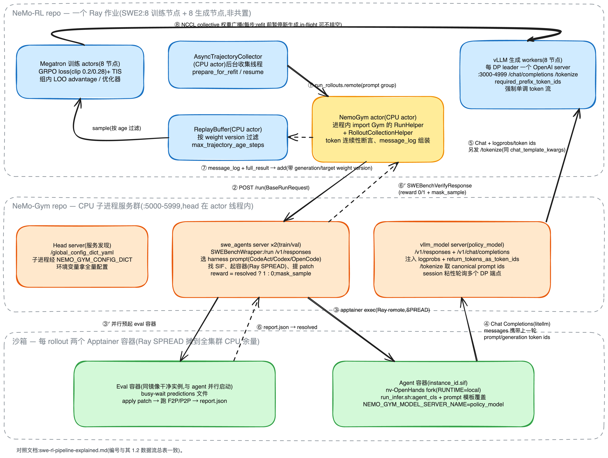

# NeMo-RL + NeMo-Gym 架构分析:以 SWE-RL 任务为主线

> 基于 `examples/nemo_gym/grpo_qwen3_30ba3b_thinking_swe2.yaml`(Async GRPO + Megatron
> 后端,在 SWE-bench/R2E-Gym 任务上用 OpenHands harness 训练 Qwen3-30B-A3B-Thinking),
> 梳理 NeMo-RL 与 NeMo-Gym 的模块边界、数据流与模块内部的信息传递机制。
> 结构对照 [Polar 架构分析](polar_architecture_swe_rl.md),末节给出与 Polar 的逐点对比。
>
> 代码引用形如 `file:line`:NeMo-RL 侧相对 RL 仓库根目录;NeMo-Gym 侧以 `Gym/` 前缀表示
> `3rdparty/Gym-workspace/Gym/`。
>
> 两阶段 recipe(SWE1 pivot / SWE2 e2e)见 `NeMo-RL/docs/guides/swe-rl-qwen3.md`;本文只讲
> SWE2 端到端 agentic 阶段——SWE1 是单步、无沙箱的
> `single_step_tool_use_with_argument_comparison` 环境,链路是本文的严格子集。

---

## 目录

1. [High-Level 架构图:边界与数据流](#1-high-level-架构图边界与数据流)
2. [一条 SWE-RL 任务的完整生命周期](#2-一条-swe-rl-任务的完整生命周期)
3. [模块拆分与职责](#3-模块拆分与职责)
4. [模块间传递什么(契约数据结构)](#4-模块间传递什么契约数据结构)
5. [模块内谁负责传递信息](#5-模块内谁负责传递信息)
6. [关键架构决策](#6-关键架构决策)
7. [与 Polar 的逐点对比](#7-与-polar-的逐点对比)

---

## 1. High-Level 架构图:边界与数据流

整个系统一共 **4 类执行体**:NeMo-RL Ray 作业(GPU,训练 + 生成 + 若干 CPU actor)、
NeMo-Gym 服务群(CPU 子进程)、agent 沙箱容器、eval 沙箱容器。

> 本图有一份可手工编辑的 Excalidraw 版本:
> [`swe-rl-pipeline-explained.excalidraw`](assets/swe-rl-pipeline-explained.excalidraw)
> (在 excalidraw.com 或 VS Code Excalidraw 插件中打开),
> 样式约定与 [`polar_architecture_swe_rl.excalidraw`](assets/polar_architecture_swe_rl.excalidraw) 一致
> (蓝 = 训练框架、橙 = CPU 环境服务、绿 = 沙箱、黄 = 桥接模块、灰虚线 = 执行体边界)。

### 1.1 四种边界

**Repo 边界(代码归属)**

- NeMo-RL repo:训练循环、Megatron、vLLM worker 与 HTTP server、async 收集器/回放缓冲、
  **NemoGym actor**(`nemo_rl/environments/nemo_gym.py`)——桥接代码放在 NeMo-RL 侧,
  运行时 import Gym 的 Python API。
- NeMo-Gym repo(`3rdparty/Gym-workspace/Gym`,以工作区形式挂载):head/agent/model
  server 基类、`swe_agents` 环境、`vllm_model` 代理、rollout 收集器。
- **nv-OpenHands fork**:第三方 harness,两个 repo 都不含其代码——`swe_agents` 在 setup
  阶段按 `agent_framework_repo`/`agent_framework_commit` clone 并 build
  (`Gym/responses_api_agents/swe_agents/app.py:1064-1089`,
  `configs/swebench_openhands_training.yaml:10-11` 钉死 fork + commit)。
  与 Polar 挂载原版 codex 二进制不同,**这里的 harness 是被 fork 改造过的**:fork 内的
  LLM 类会读 `NEMO_GYM_*` 环境变量来找 model server(见 3.5)。

**进程边界(谁跑在哪)**

- NemoGym actor 是 NeMo-RL Ray 作业里的一个 CPU actor(`@ray.remote(max_restarts=-1)`,
  `nemo_rl/environments/nemo_gym.py:145-147`);Gym 的 head server 跑在这个 actor 的
  **线程**里,其余每个 Gym server 是 head 用 `Popen` 拉起的**独立 OS 子进程**
  (`Gym/nemo_gym/cli.py:141,151-184`),各自带独立 uv venv。
- 沙箱容器不在 gateway 式的固定机器上:`swe_agents` 把每个 rollout 包成
  `runner_ray_remote`(SPREAD 调度,`Gym/responses_api_agents/swe_agents/app.py:1266-1282`),
  **由 Ray 把 apptainer 容器摊到整个集群的 CPU 余量上**。
- nv-OpenHands 是容器内的独立进程(`run_infer.sh` 子进程),agent 循环(最多
  `agent_max_turns=200` 轮)完全在 fork 内部驱动(`app.py:1198-1211`)。

**GPU/CPU 边界**

训练与生成各占 8 个 GPU 节点(`colocated.enabled=false`,
`examples/nemo_gym/grpo_qwen3_30ba3b_thinking_swe2.yaml:197-201`);NeMo-Gym 全家
CPU-only,不持任何引擎(`docs/design-docs/nemo-gym-integration.md`)。Gym 要 token 就发
HTTP 给 vLLM 的 OpenAI server(⑤);权重同步窗口由 AsyncTrajectoryCollector 的
`prepare_for_refit` 闸住**新生成的启动**(见 3.2),而不是闸代理。

**信任/隔离边界(沙箱)**

- Agent 容器:`apptainer exec --writable-tmpfs --cleanenv --pid`(`app.py:1940-1949`,
  另有 `ulimit -v` 内存上限)。OpenHands 在容器里任意改 workspace;它对外的唯一出口是
  ④——目的地是 Gym 的 `policy_model` 代理,fork 通过环境变量解析,`oh_config.toml` 的
  `base_url` 留空(`app.py:1102-1107`)。
- Eval 容器:打分不在 agent 用过的容器里做——同一 SIF 的**干净新实例**与 agent 容器
  并行启动(`app.py:1438-1443`),busy-wait 等 predictions 文件出现
  (`app.py:322-323`)再 apply patch + 跑测试。意义同 Polar:agent 改测试、污染环境
  无法影响评分。

### 1.2 数据流总表

| # | 从 → 到 | 载体/协议 | 内容 |
|---|---|---|---|
| ① | Collector → NemoGym actor | Ray remote 调用 | `run_rollouts(nemo_gym_examples, tokenizer)`;每行已注好 `temperature/top_p/max_output_tokens/_rowidx`(`nemo_rl/experience/rollouts.py:1805-1829`) |
| ② | NemoGym actor → swe_agents | HTTP JSON,`POST /run` | `BaseRunRequest{responses_create_params, agent_ref}`,任务实例信息在 `metadata`(`instance_id`、`instance_dict`…)(`Gym/nemo_gym/rollout_collection.py:582-596`) |
| ③ | swe_agents → 容器 | Ray remote(SPREAD)+ `apptainer exec` | agent 脚本 + eval 脚本;`container_formatter` → `_find_container()` 解析 SIF(`app.py:1702-1798`) |
| ④ | OpenHands → vllm_model 代理 | HTTP(OpenAI Chat Completions) | agent 的每次 LLM 调用;messages 里携带上一轮的 `prompt_token_ids+generation_token_ids`(ForTraining 字段) |
| ⑤ | 代理 → vLLM HTTP server | HTTP(Chat Completions + `/tokenize`) | 注入 `logprobs=True, return_tokens_as_token_ids=True`(`Gym/responses_api_models/vllm_model/app.py:320-330`);vLLM 侧用 `required_prefix_token_ids` 强制前缀为采样真值(`nemo_rl/models/generation/vllm/vllm_worker_async.py:505-517,654-661`) |
| ⑥ | eval 容器 → swe_agents | 文件(report.json) | F2P/P2P 结果;`reward = 1.0 if resolved else 0.0`(`app.py:2181`) |
| ⑦ | swe_agents → NemoGym actor → Collector → Buffer | HTTP 响应 → Ray | `SWEBenchVerifyResponse` → 连续性校验 + `message_log` 组装(`nemo_rl/environments/nemo_gym.py:319-458`)→ `ReplayBuffer.add(带 weight version)`(`nemo_rl/algorithms/async_utils/trajectory_collector.py:845-894`) |
| ⑧ | Megatron → vLLM | NCCL collective(GPU-to-GPU) | 每步新权重(`nemo_rl/algorithms/grpo.py:2110-2117`);同步前 `prepare_for_refit` 暂停新生成,`in_flight_weight_updates=true` 时在途请求不排空(`trajectory_collector.py:499-550`) |

判据与 Polar 相同:**跨进程的控制面都是 HTTP/Ray + Pydantic JSON**(②④⑤⑥),
**性能敏感处不走 HTTP**——权重同步走 NCCL(⑧),容器文件进出走宿主目录 bind + 拷贝
(`app.py:1319-1361`),completion 的 token 真值在生成时就地强制、不做事后重建(⑤)。

---

## 2. 一条 SWE-RL 任务的完整生命周期

与 Polar 一样,关键前提是模块边界可替换:环境(swe_agents)只认 OpenAI 兼容端点,
训练框架只认 `run_rollouts` 返回的 message_log。差别在于 NeMo-RL 与 Gym 之间不是纯
HTTP 对等体——NemoGym actor 直接 import Gym 的 Python API 并共享 Ray 集群
(`nemo_rl/environments/nemo_gym.py:164-166`),所以两边必须同版本 Ray/Python
(`docs/design-docs/nemo-gym-integration.md`)。

---

## 3. 模块拆分与职责

### 3.1 NemoGym actor — 训练侧适配器(`nemo_rl/environments/nemo_gym.py`)

角色对应 Polar 的 `slime_bridge`,但方向相反:桥接代码在**训练框架 repo** 里,import
环境框架(bridge 依赖 Gym,Gym 不依赖 NeMo-RL)。

- `_spinup()`(`:152-253`)延迟启动:等 vLLM server URL 就绪才拉起 Gym,与模型加载
  重叠。把 `policy_base_url = cfg["base_urls"]`(每 DP rank 一个)、`policy_model_name`、
  `policy_api_key="dummy_key"` 注入 Gym 全局配置(`:181-185`),head server 端口取自
  5000-5999(`:160-162,225-228`),然后 `RunHelper().start(...)`(`:238-246`)。
- `run_rollouts()`(`:255-317`):把每行交给 `RolloutCollectionHelper.run_examples`,
  **as-completed** 逐个 `await` 后处理(`:273-283`),用 `_rowidx` 尾部重排(`:305-308`);
  外层套 NaN-logprob 整批重试(`:285-303`)。
- `_postprocess_nemo_gym_to_nemo_rl_result()`(`:319-458`):token 真值的最后一道
  校验与组装,见 6.2。
- `step()`/`global_post_process_and_metrics()` 显式 `NotImplementedError`(`:463-469`)
  ——rollout 循环完全归 Gym,NeMo-RL 不做逐步交互。
- `setup_nemo_gym_config`(`:477-486`)强制 `async_engine=True`、
  `expose_http_server=True`,并清空 `stop_strings/stop_token_ids`。

### 3.2 Async GRPO 三件套 — 收集器、缓冲、训练循环

- **AsyncTrajectoryCollector**(`nemo_rl/algorithms/async_utils/trajectory_collector.py`):
  后台 `_collection_loop` 线程(`:242-270`)按 prompt group 派 worker;
  `_run_prompt_group_worker` 在 `_should_use_nemo_gym` 时调
  `run_async_nemo_gym_rollout`(`:781-794`);完成的组
  `replay_buffer.add.remote(traj, generation_weight_version, target_weight_version)`
  (`:845-894`,满则指数退避)。**refit 协议**:`prepare_for_refit`(`:499-550`)
  暂停新生成;async vLLM + `in_flight_weight_updates` 时**不等在途请求排空**
  (`:532-541`),否则阻塞至排空;`resume_after_refit`(`:552-575`)可选地失效
  KV/prefix cache(`recompute_kv_cache_after_weight_updates`)。
- **ReplayBuffer**:容量 `num_prompts_per_step × max_trajectory_age_steps × slack`
  (`nemo_rl/algorithms/grpo.py:3689-3696`);训练循环
  `sample(num_prompt_groups, current_weight_version, max_age_steps)`(`:3912-3918`)
  按 weight version 过滤 staleness。
- **`async_grpo_train`**(`grpo.py:3543` 起):train → `prepare_for_refit`(`:4270`)→
  `refit_policy_generation`(`:4281-4287`)→ `weight_version += 1` 广播给 collector
  (`:4290-4292`)。off-policy 残差交给 loss 侧的 TIS
  (`truncated_importance_sampling_ratio: 5.0`,recipe `:40-43`)。

### 3.3 vLLM OpenAI HTTP server — 生成引擎的对外面孔

每个 DP leader 一个(TP/PP rank-0 上报 URL,
`nemo_rl/models/generation/vllm/vllm_generation.py:463-491`),端口在 `__init__` 就预留
(`vllm_worker_async.py:215-251`),FastAPI + uvicorn(`:900-943`)。端点:

- `POST /v1/chat/completions`(`:764-810`):**断言请求的 `temperature/top_p` 与训练
  配置完全一致**(`:770-778`)——环境不许私改采样参数,保证 on-policy;
- `POST /tokenize`(`:845-856`):给代理取 canonical prompt token ids;
- `NeMoRLOpenAIChatRequestMixin`(`:505-517`):从 messages 里最后一个带
  `prompt_token_ids` 的消息拼出 `required_prefix_token_ids = prompt_ids + generation_ids`;
- `preprocess_chat` override(`:549-669`):对当前请求做两次模板渲染(全量 + 截到最后
  一条 assistant),再 `_replace_prefix_tokens`(`:54-160`)把"模板对上一轮 assistant
  的重分词副本"按 EOS 定位后整段换成采样真值,并对超长 prompt 做 `_clamp_max_tokens`。

### 3.4 NeMo-Gym 服务群 — head / vllm_model 代理

- **拓扑**:四类 FastAPI server 共享基类
  (`Gym/nemo_gym/server_utils.py:360-378,480-697`);head 是服务发现注册表
  (`:700-739`),peer 间靠"名字 → 全局配置查 host:port"寻址(`:260-295`,
  `ModelServerRef` 等类型化引用 `Gym/nemo_gym/config_types.py:113-129`)。子进程通过
  `NEMO_GYM_CONFIG_DICT` 环境变量拿到完整配置(`Gym/nemo_gym/cli.py:178-181`)。
- **vllm_model 代理**(`Gym/responses_api_models/vllm_model/app.py`):一身两职——
  (a) 方言翻译:`VLLMConverter` 双向映射 Responses items ↔ Chat messages
  (`:620-950`),`<think>` 标签抽取 reasoning(`:628,920-923`);
  (b) **token 真值捕获**(仅 `vllm_model_for_training.yaml` 打开
  `return_token_id_information: true`):请求侧注入 `logprobs=True,
  return_tokens_as_token_ids=True`(`:320-330`);响应侧从 logprobs 的
  `token_id:` 前缀解析出 `generation_token_ids`(`:511`),**另发一次 `/tokenize`**
  (带同样的 `model/messages/tools/chat_template_kwargs`,`:513-526`)取
  `prompt_token_ids`,三件套挂到模型轮最后一个 output item(`:531-541,906-916`)。
- **负载均衡**:每个 vLLM base URL 一个 client(`:121-133`),按 **session id 粘性**
  轮询(`:570-579`)——同一 rollout 的多轮请求钉在同一 DP 副本上,前缀缓存友好。

### 3.5 swe_agents — SWE 环境 + harness 启动器(`Gym/responses_api_agents/swe_agents/`)

`SWEBenchWrapper(SimpleResponsesAPIAgent)`(`app.py:1625`),端点 `/run`、`/v1/responses`、
`/aggregate_metrics`(基类 `Gym/nemo_gym/base_responses_api_agent.py:43-52`)。

- **harness 三件套是同一个 OpenHands fork 的三种 `agent_cls`**:
  `CodeActAgent / OpenCodeAgent / CodexAgent`(`app.py:77-80`)+ 各自的 Jinja prompt
  (`prompts/{openhands,opencode,codex}/`)。每个 instance 按
  `agent_prompt_overrides` 选一个(确定性 `random.Random(instance_id).choice`
  或均匀随机,`app.py:2046-2057`),选中的模板 bind-mount 覆盖 fork 默认模板
  (`app.py:1832-1842`)。Codex/OpenCode 是 **prompt/工具约定层面的仿真**,不是真的
  codex/opencode CLI 二进制。
  (注:recipe YAML 里的 `run_with_mixed_prompts: true` 字段在当前 Gym checkout 的
  `SWEBenchWrapperConfig` 中不存在——当前代码里"混合"就是上述 override 选择逻辑,
  该字段对应的应是另一版 Gym。)
- **LLM 路由**:生成 per-run TOML 时 `base_url` 留空(`app.py:1102-1107`),真正的路由
  靠三个环境变量注入容器:`NEMO_GYM_CONFIG_DICT`(整份全局配置 YAML)、
  `NEMO_GYM_MODEL_SERVER_NAME`(= `model_server.name`,即 `policy_model`)、
  `NEMO_GYM_METRICS_FPATH`(`app.py:1182-1184,1644-1645`)。fork 内的 LLM 类按名字从
  配置里解析出代理 URL——这段解析代码在 nv-OpenHands fork 里,本仓库不可见。
- **沙箱**:`_find_container()` 把 `container_formatter` 模板解析成 SIF 路径,含
  SWE-rebench/R2E-Gym 的专有改写与 fuzzy glob(`app.py:1702-1798`);
  `_build_apptainer_command()`(`app.py:1800-1951`)组出
  `apptainer exec --writable-tmpfs --cleanenv --pid ...`。
- **评估**:reward 严格 0/1(`app.py:2181`);按数据集家族分 processor——SWE-bench
  (`swebench.harness.run_local_evaluation`,`app.py:356-393`)、R2E-Gym(`:504-536`)、
  SWE-rebench(容器内 `git apply` + `test_cmd`、宿主侧解析,`:746-900`)、
  swe-bench-ext(多语言多测试框架,`swe_bench_ext/frameworks.py:22-174` 映射
  pytest/jest/go/junit/cargo 等的输出解析,`swe_bench_ext/utils.py:150-152` 判
  `resolved = 全部 F2P 过 且 全部 P2P 过`)。
- **样本屏蔽**:resolved 但曾出现 max_iteration/context_window 错误、或 agent/eval
  超时的样本,置 `mask_sample`(`app.py:2126-2131`),训练侧转成
  `loss_multiplier=0` 整条剔除。
- **轨迹回传**:OpenHands 落盘的 `llm_completions/*.json` 拷回宿主
  (`app.py:1446-1449`),`VLLMConverter.chat_completions_messages_to_responses_items`
  转成 Responses items(`app.py:2141-2144`,`return_token_id_information=True`
  `:1654`),token 三件套从 `provider_specific_fields` 提取(`:1687-1689`)。

### 3.6 数据与 loss 路径(NeMo-RL 侧)

- 数据:JSONL 原样进 `NemoGymDataset`
  (`nemo_rl/data/datasets/response_datasets/nemogym_dataset.py:20-48`,行内容存为
  raw string),`nemo_gym_data_processor`(`nemo_rl/data/processors.py:761-779`)
  `json.loads` 进 `extra_env_info`,`message_log` 只放一个占位空 user 消息——真正的
  token 全部由 Gym 产出。
- `run_async_nemo_gym_rollout`(`nemo_rl/experience/rollouts.py:1749-2059`):注采样
  参数与 `_rowidx`(`:1805-1821`)→ `run_rollouts.remote`(`:1823-1829`)→ 张量化
  `token_ids/generation_logprobs`(`:1832-1838`)→ `final_batch` 带
  `total_reward = full_result["reward"]`、`loss_multiplier`、`truncated`、`mask_sample`
  (`:1995-2019`)。
- loss mask:`add_grpo_token_loss_masks_and_generation_logprobs`
  (`nemo_rl/algorithms/grpo.py:1556-1584`)——**只有带 `generation_logprobs` 的
  assistant 消息 token_loss_mask=1**;Gym 注入的工具输出/模板胶水都是 user 消息,
  mask=0。
- advantage:组内 leave-one-out + 可选 std 归一
  (`nemo_rl/algorithms/advantage_estimator.py:44-82`);消息级惩罚
  (`invalid_tool_call_advantage=-5.0`、`malformed_thinking_advantage=-5.0`,
  recipe `:25-28`)直接覆写被标记 token 的 advantage
  (`grpo.py:1587-1600`;标记来自 `nemo_rl/environments/nemo_gym.py:85-142`)。

---

## 4. 模块间传递什么(契约数据结构)

| 边界 | 载体 | 关键字段 |
|---|---|---|
| 数据集 → 训练循环 | `DatumSpec`(`nemo_rl/data/processors.py:761-779`) | `extra_env_info` = 原始 Gym 行(`responses_create_params` + `agent_ref` + metadata);占位 `message_log` |
| Collector → NemoGym actor | `nemo_gym_examples: list[dict]`(`rollouts.py:1766-1829`) | 每行注入 `temperature/top_p/max_output_tokens/_rowidx` |
| NemoGym actor → swe_agents | `BaseRunRequest`(`Gym/nemo_gym/rollout_collection.py:582-596`) | `responses_create_params`(`metadata` 含 `instance_id`、`instance_dict` JSON、`dataset_name`)、`agent_ref` |
| swe_agents → OpenHands | per-run TOML + 环境变量(`app.py:1102-1107,1182-1184`) | `llm.model.{model,temperature,top_p}`;`base_url=""`;`NEMO_GYM_MODEL_SERVER_NAME/CONFIG_DICT` |
| OpenHands → 代理 → vLLM | Chat Completions | messages 内嵌上一轮 `prompt_token_ids+generation_token_ids`(ForTraining mixin,`Gym/nemo_gym/openai_utils.py:100-109,198-224`)→ vLLM 侧 `required_prefix_token_ids` |
| 代理 → swe_agents(经 fork 落盘) | assistant 消息 + token 三件套 | `prompt_token_ids`(来自 `/tokenize`)、`generation_token_ids`(采样真值)、`generation_log_probs`(`vllm_model/app.py:503-541`);只挂在模型轮最后一个 item |
| swe_agents → RCH → NemoGym actor | `SWEBenchVerifyResponse`(`app.py:249-250,2178-2186`) | `reward`(0/1)、`resolved`、`model_patch`、`agent_error_kind`、timing metrics、`instance_config.mask_sample`;`response.output` = 带 token 字段的 Responses items |
| NemoGym actor → rollouts.py | `{"message_log", "input_message_log", "full_result"}`(`nemo_gym.py:454-458`) | user 消息 = 增量 prompt tokens(mask=0);assistant 消息 = `token_ids + generation_logprobs + is_invalid_tool_call + has_malformed_thinking`(mask=1) |
| rollouts.py → Buffer → 训练 | `AsyncNemoGymRolloutResult`(`rollouts.py:2055-2059`)+ weight version 标签(`trajectory_collector.py:857-861`) | `input_ids`、`final_batch{message_log, total_reward, loss_multiplier, truncated}`、rollout metrics |
| 训练批 | flat message(`grpo.py:4087-4098`) | `token_loss_mask`、`generation_logprobs`(TIS 用)、`total_reward` → LOO advantage |

对照 Polar 的判据依然成立:凡是契约都是 Pydantic 模型(Gym 的
`BaseVerifyResponse`/`NeMoGymResponse`、NeMo-RL 的 TypedDict/BatchedDataDict);
token 三件套的**权威副本在生成侧产生**(vLLM 采样 + `/tokenize`),下游只做搬运和校验,
从不重建。

---

## 5. 模块内谁负责传递信息

### NemoGym actor

`run_rollouts` 自己就是枢纽:`RolloutCollectionHelper.run_examples` 返回 as-completed
迭代器,逐个 `await` → `_postprocess_nemo_gym_to_nemo_rl_result` → `_rowidx` 重排
(`nemo_gym.py:267-308`)。`seen_token_ids` 是贯穿单条轨迹组装的游标状态:每处理一个
trainable item 就 extend 增量 prompt + 采样 tokens(`:418-419`),前缀断言在它之上。

### AsyncTrajectoryCollector

`_collection_loop` 线程是搬运者(`trajectory_collector.py:242-270`);三个控制原语
`prepare_for_refit / set_weight_version / resume_after_refit` 由训练循环驱动;
`_should_pause_for_generation_limits`(`:208-241`)在目标版本配额满时主动停,防止
生产过剩浪费(与 Slime bridge 的 admission window 同职责,机制不同:按 weight
version 配额而非在途任务窗口)。

### vllm_model 代理

`VLLMConverter` + 状态机 buffer(`VLLMConverterResponsesToChatCompletionsState`,
`app.py:582-617`)是唯一的方言翻译者;`_resolve_client` 用 session cookie 做
DP 副本粘性(`:570-579`)。token 三件套的装配点在 `chat_completions`(`:503-541`)。

### swe_agents

- `OpenHandsHarnessProcessor`:setup(clone/build fork)+ `get_run_command`(生成
  shell 命令与 TOML,自己不执行,`app.py:1064-1211`)——对应 Polar 的"harness preset
  只产命令描述";
- `RunOpenHandsAgent.process_single_datapoint`(`app.py:1423-1558`)是实际执行者与
  胶水层:双容器并行、超时看护、`output.jsonl`/`llm_completions` 拷回、patch 提取、
  eval 触发;
- `runner_ray_remote`(SPREAD)把以上整体摊到集群(`app.py:1266-1282`)。

### vLLM HTTP server

`NeMoRLOpenAIChatRequestMixin.model_post_init` 从 messages 反挖 required prefix
(`vllm_worker_async.py:505-517`);`preprocess_chat` override 是唯一的 token 流改写点
(`:549-669`);engine 输入 socket 加线程锁,防 HTTP 请求与 in-flight 权重更新 RPC
竞争(`:313-329`)。

---

## 6. 关键架构决策

### 6.1 harness 接入:fork 改造,而不是零侵入

Polar 的核心技巧是"agent 不知道框架存在"(OPENAI_BASE_URL + session_id-as-API-key);
NeMo-Gym 的 OpenHands 路线相反:**维护一个 nv-OpenHands fork**,fork 内 LLM 类读
`NEMO_GYM_*` 环境变量解析 model server。代价是要维护 fork(commit 钉死在 config 里);
收益是可控性——fork 会把每轮完整请求落盘 `llm_completions/*.json`(轨迹重建的原料)、
接受 prompt 模板 bind-mount 覆盖、并把 token 三件套塞进 `provider_specific_fields`
一路带回。"三个 harness"共享这一个 fork,差异只在 `agent_cls` + prompt 模板。

### 6.2 token 真值:生成时强制单调,而不是事后拼接

这是与 Polar `prefix_merging` 最本质的差异。两者要解决同一个问题(采样 token 嵌回
文本后 BPE 重分词漂移),路线不同:

1. **强制层(生成时,vLLM server 内)**:每次请求带上一轮的
   `prompt_token_ids + generation_token_ids`;`_replace_prefix_tokens`
   (`vllm_worker_async.py:54-160`)把模板重渲染出的"上一轮 assistant 的重分词副本"
   按最后一个 EOS 定位,**整段替换为采样真值**,EOS 之后接本轮模板的新增尾部。效果:
   引擎实际 prefill 的 token 流 = 上一轮真值 ++ 新胶水,轨迹全程**单调递增**。
   docstring 里给了具体例子(`" 4"` 被采样成 `[220,17]`、重分词成 `[1001]` 的替换过程,
   `:95-108`)。
2. **捕获层(代理内)**:`generation_token_ids` 从 logprobs 的 `token_id:` 前缀解析
   (采样真值);`prompt_token_ids` 由 `/tokenize` 用**同一份 chat_template_kwargs**
   产出(`vllm_model/app.py:513-526`)——由于第 1 层已强制前缀,这份 canonical prompt
   与真值流一致。
3. **校验层(NemoGym actor 内)**:`seen_token_ids == prompt_token_ids[:len(seen)]`
   断言(`nemo_gym.py:338-344`),**fail-fast**——不满足直接炸,而不是像 Polar 那样
   break 截断。增量切片 `prompt_token_ids[len(seen):]` 做 mask=0 的 user 消息
   (`:350,383-390`),采样段原样做 mask=1 的 assistant 消息(`:404-416`)。

推论:Polar 文档里讨论的"残余二阶不一致"(推理条件含重分词副本、训练条件含采样真值)
在这条链路上**不存在**——推理时的条件就已经是采样真值。代价是必须改造引擎入口
(`preprocess_chat` override),这在 Polar 的"引擎只需支持标准 Chat API"前提下不可行。
残余的 off-policy 来源只剩 async 陈旧度,交给 TIS(`truncated_importance_sampling_ratio=5.0`)。

### 6.3 采样参数锁死

`/v1/chat/completions` 断言请求的 `temperature/top_p` 与训练配置逐字段一致
(`vllm_worker_async.py:770-778`)。环境/harness 无法私自改采样分布——on-policy 性质
由服务端 enforce,而不是靠约定。

### 6.4 调度:Ray 原生,而不是自建控制面

Polar 用 rollout server + gateway 注册/心跳/负载均衡自建控制面;这里的对应物全是
Ray 原语——NemoGym actor 无限重启(`max_restarts=-1`)、沙箱按 SPREAD 摊到集群、
asyncio semaphore 控并发(`concurrency: 768`)。没有独立的"gateway 机器"概念,
CPU 资源就是集群里 GPU 节点的余量。

### 6.5 异步与权重同步:version 标签 + 可选不排空

轨迹带 `generation_weight_version/target_weight_version` 标签,buffer 按
`max_trajectory_age_steps` 过滤;refit 只暂停**新生成的启动**,
`in_flight_weight_updates=true` 时在途请求带着旧 KV cache 跑完(Magistral 式),
可选 `recompute_kv_cache_after_weight_updates` 切 AREAL 式失效重算
(`trajectory_collector.py:532-575`)。Slime/Polar 的做法是 admission window +
staleness 淘汰,方向一致,粒度不同(按 version 配额 vs 按在途任务数)。

### 6.6 坏样本处理:mask 而不是低分

超时、上下文溢出等"不可归因于策略质量"的失败不给 0 分,而是 `mask_sample` →
`loss_multiplier=0` 整条剔除(`app.py:2126-2131`);格式性失败(invalid tool call、
malformed thinking)则绕过 reward 直接覆写 advantage=-5(`grpo.py:1587-1600`)。
reward、样本屏蔽、格式惩罚是三个独立通道。

---

## 7. 与 Polar 的逐点对比

| 维度 | Polar(+Slime) | NeMo-RL + NeMo-Gym |
|---|---|---|
| 桥接代码归属 | Polar repo 内的 `slime_bridge`,被 Slime 进程 import | NeMo-RL repo 内的 `NemoGym` actor,import Gym 的 Python API |
| 训练↔环境边界 | 纯 HTTP(TaskRequest/TaskResult + callback) | Ray remote 调用 + 进程内迭代器;Gym 服务间才是 HTTP |
| harness 接入 | 未改动的 codex 二进制,零侵入(base_url + API-key 偷换) | nv-OpenHands **fork**,读 `NEMO_GYM_*` 环境变量;Codex/OpenCode 为 prompt 仿真 |
| session 归属 | session_id 藏在 API key,gateway 反查 | per-run TOML/目录 + session cookie 粘性;无 API-key 技巧 |
| token 真值 | 事后 `prefix_merging`:前缀匹配归链,漂移段丢进 mask=0 区 | 生成时 `_replace_prefix_tokens` 强制单调流;事后只做 fail-fast 断言 |
| prompt token ids 来源 | SGLang patch 透传 | 独立 `/tokenize` 调用(同 chat_template_kwargs) |
| 残余训推不一致 | 二阶 gap(推理条件含重分词副本),TIS 兜底 | 单调流下不存在;TIS 只兜 async 陈旧度 |
| 引擎改造 | 两个小 patch(token 透传) | `preprocess_chat`/serving mixin 级 override(引擎入口深度定制) |
| 沙箱调度 | gateway 进程本地起容器,gateway 水平扩展 + 心跳 | Ray SPREAD remote 摊到全集群,无独立 gateway 层 |
| 评分隔离 | 干净 eval 容器,INIT 期预热 | 干净 eval 容器,与 agent 容器并行启动 + busy-wait |
| reward | 0/1 resolved | 0/1 resolved;另有 mask_sample 剔除 + 消息级 advantage 惩罚 |
| 异步机制 | admission window + staleness 淘汰 + LOO | ReplayBuffer + weight version + `max_trajectory_age_steps` + in-flight 更新 |
| advantage | leave-one-trajectory-out(bridge 内) | 组内 LOO + std 归一(`advantage_estimator.py:44-82`) |
| 权重同步 | NCCL,gateway `/admin/inference/pause` 闸出向请求 | NCCL collective,collector 暂停新生成(在途可不排空) |

一句话概括:Polar 选择"**不碰 harness、不碰引擎语义,漂移事后清理**";
NeMo-RL + NeMo-Gym 选择"**fork harness、深改引擎入口,漂移在生成时就不允许发生**"。
前者换来任意 agent 的零成本接入,后者换来更干净的训练信号和更少的运行时兜底逻辑。
